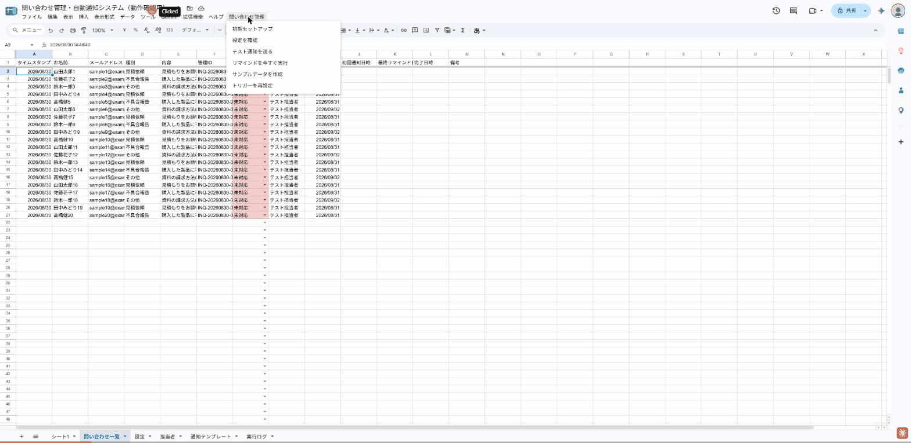
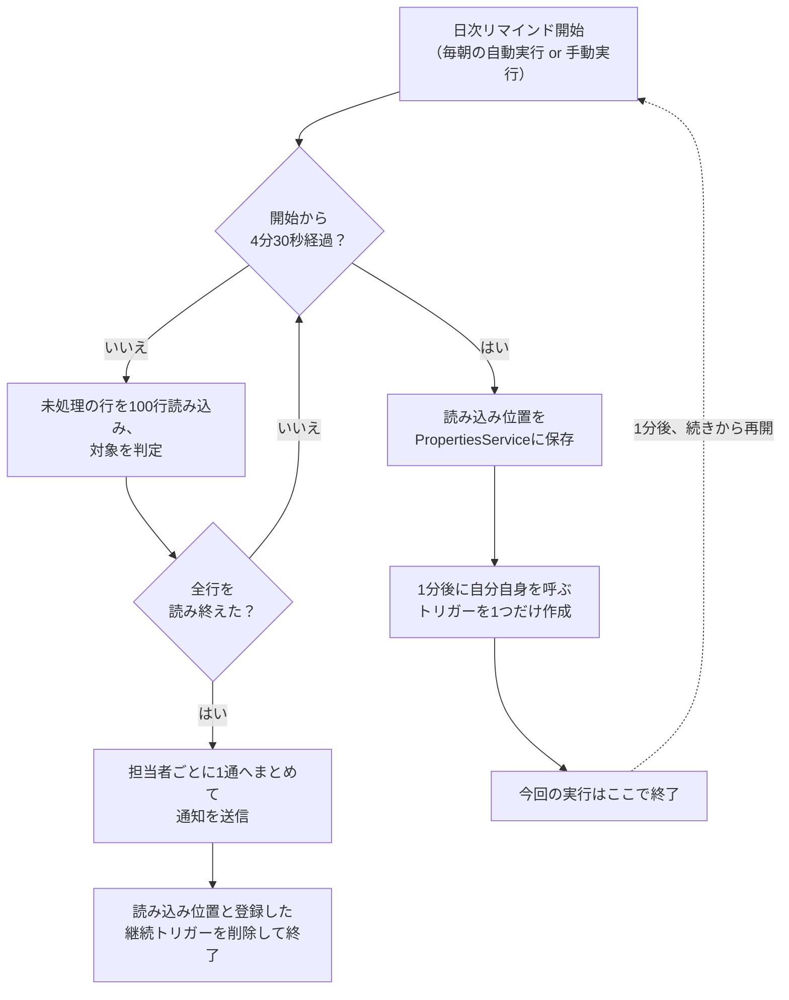

# 問い合わせ管理・自動通知システム（Google Apps Script）

問い合わせの一次対応が遅れる、担当が決まらない、対応漏れが起きる——この3つを自動化で解決するツールです。Googleフォームで受け付けた問い合わせが、スプレッドシートに入ってきた瞬間に担当者へ自動で通知され、対応が止まっている案件だけを毎朝リマインドしてくれます。「毎朝スプレッドシートを開いて確認する」という運用をなくすことが目的です。



<!-- TODO: 上記は実際の操作（フォーム送信→通知が届く→リマインドが飛ぶ、15秒程度）を録画したGIFに差し替えてください。docs/demo.gif に配置するだけで表示されます。 -->

## できること

- フォーム送信と同時に、管理ID発行・担当者の自動割り当て・対応期限の計算までを自動実行
- 種別・担当者に応じてメールまたはSlackで即座に通知（Slackは任意です。メールだけでも運用できます）
- 対応期限が近い、または過ぎている案件だけを、毎朝担当者ごとに1通へまとめてリマインド（1件ごとに送りつけて受信箱を埋めることはしません）
- 期限を過ぎた案件は、担当者に加えて管理者にも自動でエスカレーション通知
- 通知文面・担当者・営業日・SLA日数などは、すべて「設定」シートの入力だけで変更可能（※ 初回のスクリプト設置のみエンジニアが必要です。それ以降の日常運用・カスタマイズはコードを一切触らずスプレッドシート上だけで完結します）

## 始める前に

- Googleアカウント（個人のGmail、またはGoogle Workspace）が必要です
- 問い合わせを受け付けるGoogleフォームと、その回答が入るスプレッドシートが既にあること
- 「導入手順」の前に、担当エンジニアによる初回設置（スプレッドシートへのスクリプトの紐付け）が完了していること（コマンドは本ページ末尾の「開発者向け: 初回設置」参照。所要時間の目安は15分程度です）

## 導入手順

スクリプトの設置が完了していれば、以降はすべてスプレッドシート上の操作だけで完了します（所要時間の目安: 10分程度）。

1. スプレッドシートを開き、メニューバーの **「問い合わせ管理」→「初期セットアップ」** をクリックする（5つのシートと自動通知用のトリガーがまとめて作られます）
2. 「担当者」シートに、対応する担当者の名前・メールアドレス・担当種別を入力する
3. 「設定」シートを開き、通知方法（メール／Slack）や管理者メールアドレスなど、自社の運用に合わせて内容を確認・修正する
4. メニューの **「テスト通知を送る」** をクリックする。数秒後に、手順3で設定したメールアドレス（またはSlack）にテストメッセージが届けば成功です。届かない場合は、まず「担当者」シート・「設定」シートのメールアドレスに誤字がないか、Gmailの迷惑メールフォルダに入っていないかを確認してください
5. 問題なければ「設定」シートの「テストモード」のセルに、直接 `FALSE`（半角・大文字）と入力する。これで運用開始です。「実行ログ」シートを見れば、これまでのテスト送信の記録も確認できます

<!-- TODO: 各手順のスクリーンショットを docs/ に追加し、ここにMarkdown画像として貼ってください（例: ） -->

## 設定シートの説明

「設定」シートのB列（値）を書き換えるだけで、以下すべての挙動を変更できます。

| 設定キー | 初期値 | 説明 |
|---|---|---|
| 通知方法 | メール | メール / Slack / 両方 |
| Slack Webhook URL | （空） | Slack を使う場合のみ入力 |
| 管理者メールアドレス | （空） | エラー通知とエスカレーションの送信先 |
| リマインド実行時刻 | 9 | 0〜23 の整数 |
| SLA日数_見積依頼 | 1 | 営業日 |
| SLA日数_不具合報告 | 1 | 営業日 |
| SLA日数_その他 | 3 | 営業日 |
| 営業日 | 月,火,水,木,金 | カンマ区切り |
| 休業日 | （空） | `2026-12-29,2026-12-30` のような日付のカンマ区切り |
| リマインド対象日数 | 1 | 期限まで何日以内の案件を通知するか |
| テストモード | TRUE | TRUE の間は実際には送信せずログのみ記録 |
| ログ保持行数 | 1000 | これを超えたら古い行から自動削除 |

入力に問題がある場合、メニューの「設定を確認」を押すと該当セルが赤くなり、何が問題かがダイアログで表示されます。

## カスタマイズ方法

すべてシート上の操作だけで完結し、コードを書く必要はありません。

- **通知文面を変えたい**: 「通知テンプレート」シートの該当行（新規受付／リマインド／期限超過／日次サマリ）のB列（件名）・C列（本文）を書き換えるだけです。`{{管理ID}}` のように `{{ }}` で囲まれた部分は、送信時に実際の値へ自動的に置き換わります。
- **担当者を増減したい**: 「担当者」シートに行を追加・削除するだけです。同じ種別に複数人登録されている場合は、順番に自動で割り当てられます（例: 見積依頼の担当者がAさん・Bさん・Cさんの3人いる場合、1件目はAさん、2件目はBさん、3件目はCさん、4件目はまたAさんに戻る、という形で公平に振り分けます）。E列を `FALSE` にすると一時的に割り当て対象から外せます。
- **対応期限（SLA）を変えたい**: 「設定」シートの `SLA日数_◯◯` を書き換えるだけです（例: 見積依頼の対応期限を2営業日にしたい場合は `2` に変更）。
- **営業日・休業日を変えたい**: 「設定」シートの「営業日」「休業日」を書き換えるだけです。年末年始や祝日を「休業日」に追加すれば、対応期限の計算に自動反映されます。

## 技術的な工夫

*（ここから先は内部実装の話です。運用担当者の方はこのセクションを読み飛ばしていただいて構いません）*

問い合わせ件数が増えても壊れないよう、いくつかの工夫を入れています。

**6分の実行時間制限への対応**（GASは1回の実行が最大6分までという制約があります）。日次リマインドは対象行数が多いと6分を超える可能性があるため、100行ずつバッチ処理し、実行開始から4分30秒が経過した時点で安全に中断→1分後に自分自身を呼び直すトリガーを設定→続きから再開、という設計にしています。



このとき、次の点にも気をつけています。

- 中断時に保存する情報は「どこまで読んだか（行番号）」だけにしています。担当者名や本文まで保存しようとすると `PropertiesService` の1件あたり9KBという上限をすぐに超えてしまうためです。全行の読み込みが終わった後で、対象になった行だけをシートから読み直して通知内容を組み立てます。
- 保存した読み込み位置には実行日も一緒に記録し、日付が変わっていたら破棄して最初からやり直します。継続トリガーが何らかの理由で発火しなかった場合に、前日の途中位置から再開して当日分の前半行を読み飛ばしてしまう事故を防ぐためです。
- `LockService` で排他制御し、フォーム送信時の処理と日次リマインドが同時に走っても競合しないようにしています。
- スプレッドシートへのアクセスは `getValues()`/`setValues()` による一括取得・一括書き込みに統一し、行ごとに1セルずつ読み書きすることはしていません（件数が増えるほど遅くなり、6分制限に抵触しやすくなるため）。

## 動作環境と費用

- Googleアカウント（個人のGmailアカウント、またはGoogle Workspaceアカウント）だけで動作します。追加のサーバーや外部サービスの契約は不要です。
- Google Apps Scriptの無料枠内で動作する設計にしています。追加費用は発生しません。
- Slack通知を使う場合は、Slack側でIncoming Webhookを1つ発行するだけで連携できます（Slackアプリの作成に費用はかかりません）。

## 制約事項

- メール送信数には Google Apps Script のクォータ上限があります（個人のGmailアカウントと Google Workspace アカウントで上限が異なります）。問い合わせ件数が多い場合は、Google Workspace アカウントでの運用を推奨します。正確な最新の上限値は [Google Apps Script の公式クォータ表](https://developers.google.com/apps-script/guides/services/quotas) でご確認ください（クォータは変更される場合があります）。
- Slack通知はIncoming Webhookのみに対応しています（Bot TokenやSlackアプリの高度な機能は未対応です）。
- 以下はスコープ外です: Webアプリ化・独自UI、ユーザー認証・権限管理、添付ファイルの処理、返信メールの自動取り込み、多言語対応、外部データベース連携、単体テストフレームワークの導入。

## 困ったときは

- まず「実行ログ」シートを確認してください。成功・失敗を含めたすべての処理結果と、原因のメッセージが記録されています。
- 「設定」シートの内容に問題がある場合は、メニューの「設定を確認」で該当セルと原因が分かります。
- それでも解決しない場合は、[GitHub Issues](https://github.com/yone-haru/gas-inquiry-flow/issues) でお知らせください。

## 開発者向け: 初回設置

運用担当者の方は読む必要はありません。エンジニアがスクリプトを初めてスプレッドシートに紐付ける際の手順です。

```bash
npm install                 # 依存インストール（@google/clasp, eslint）
npm run login                # clasp未ログインの場合のみ
npx clasp create --title "問い合わせ管理" --type sheets   # 新規の場合
# または既存のスクリプトに合わせる場合: npx clasp clone <scriptId>
npm run push                 # ソースをスクリプトエディタへ反映
```

`.clasp.json.example` を参考に `.clasp.json` を作成し、`rootDir` を `./src` にしてください。コマンドの詳細・開発時の注意点は `.claude/CLAUDE.md` を参照してください。
